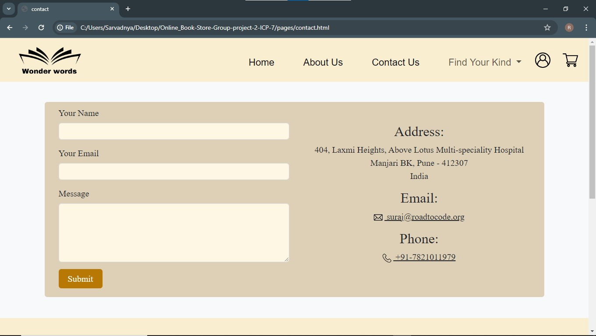

# Project-Name: online_bookstore_website_project-2_icp7.0

---
# Project-Title: Wonder Words Bookstore

---
Welcome to the Online Bookstore repository! This website is designed to showcase information about a online bookstore, including details about newly arrivals, different categories of books and current discount offers,etc. Feel free to explore the different pages and what services book store offers. If you have any questions or suggestions, please don't hesitate to reach out. Enjoy your visit!
This Project is simply made by using HTML,CSS,Bootstrap and Javascript. Weather you are Beginner Student to coding or Web Development this repository will be your go to resource for HTML,CSS,Bootstrap and Javascript.

---
## Features
1. Home Page
2. Login Page
3. About Us Page
4. Registration Page
5. Best Sellers Page
6. Newly Arrival Page
7. Payment Page
8. Contact Us Page
9. Add to cart Page
---
### Home Page

The home page of the website displays a list of best sellers, new arrivals and categories for users to browse through. It also includes search.

The home page is the first page that users will see when they visit our website. 

Wonder Words Bookstore website, which displays a list of best sellers and new arrivals.

Users can search for books by entering keywords in the search bar or browse through categories such as "Fiction", "Nonfiction", "Users can click on any book's image or Users can click on any book's image or Users can click on any book to add it into Users 

---

## How to Contribute 🪴💻

We welcome contributions from the community to help us expand and improve this handbook if you would like to contribute follow the steps:

1. Fork the repository to your GitHub account.
2. Make your changes ,add new content or fix the existing issues.
3. Open pull request in this repository.

---

